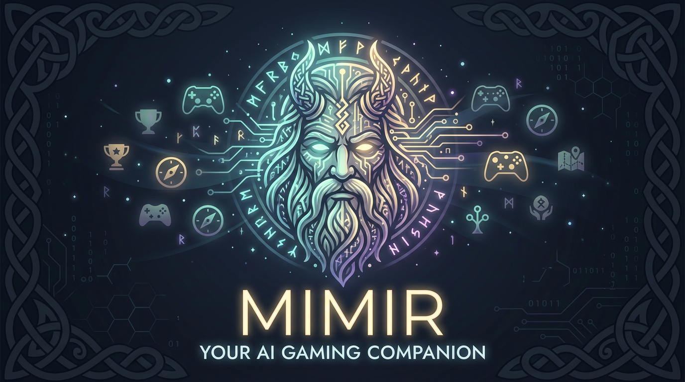

<p align="center">
  
</p>

# mimir

> Your AI gaming companion — like having a friend who's beaten every game.

Back in the 90s, gaming magazines were the perfect companion. You'd play blind, get stuck, and only then flip to the walkthrough — just enough to get unstuck, never enough to ruin the journey. Mimir is that friend. It knows everything, but only tells you what you need.

## What it does

- **Explore mode** — playing blind? Mimir gives directional hints only, respects your checkpoint, never spoils what's ahead
- **Platinum mode** — ready to 100%? Mimir plans the most efficient trophy route, flags missables, and keeps you on track
- **Game-isolated context** — no cross-game confusion. Your DS3 session knows nothing about your Elden Ring session
- **Persistent memory** — your progress and notes survive between sessions

## Install

```bash
git clone https://github.com/callegas/mimir
mkdir -p ~/.claude/skills/session && cp mimir/skill/session.md ~/.claude/skills/session/SKILL.md
```

Requires [Claude Code](https://claude.ai/code). No API key or Node.js needed. Start a new session after installing.

## Usage

In any Claude Code session:

```
/session
```

Mimir will resume your last active game, or walk you through starting a new one. Trophy lists are generated from Claude's own knowledge — no external data needed.

### Commands (inside a session)

```
done <trophy name>     — mark a trophy as done (fuzzy match)
undone <trophy name>   — unmark a trophy
list                   — show pending trophies, missables highlighted
list all               — show all trophies including completed
plan                   — optimal completion order for your mode
note <text>            — update your session notes
mode explore           — blind run mode (no spoilers)
mode platinum          — full spoilers, efficient routing
switch <game>          — switch to a different game
```

Or just ask anything — Mimir answers within your current mode rules.

## Philosophy

Mimir doesn't play the game for you. It's the friend on the couch who's beaten it twice — they'll tell you there's something important in that room, but they won't tell you what it is until you ask. The experience is yours. Mimir just makes sure you don't miss anything.

## Data

All your data lives locally in `~/.mimir/` — one JSON file per game. Nothing leaves your machine.
